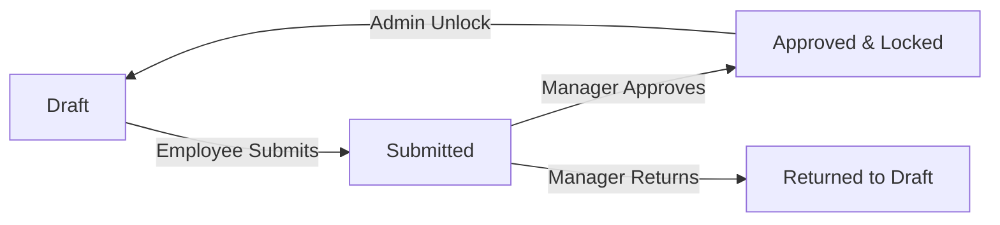

# ZenithOKR (formerly AtomQuest)

ZenithOKR is a high-performance corporate SaaS-style goal setting and tracking dashboard designed for small-to-medium teams. It implements a complete quarterly goal lifecycle (draft → submitted → approved/returned), check-in progression scores, security-stamped audit logging, automated manager escalation rules, and interactive executive analytics.

The application features a modern interface built around the **Numerro Design System** color spaces, offering fully responsive dark and light modes with seamless user transition.

---

## 🏗️ System Architecture & Directory Layout

The codebase is split into a structured FastAPI Python backend and a React (Vite + TypeScript) frontend:

```text
atomquest/
├── backend/
│   ├── main.py              # Application entrypoint & monolithic route registration
│   ├── models.py            # SQLAlchemy database ORM model definitions
│   ├── schemas.py           # Pydantic request/response validation schemas
│   ├── database.py          # SessionLocal database engine factory
│   ├── limiter.py           # API endpoint rate-limiting configuration
│   ├── auth/
│   │   ├── dependencies.py  # Auth handlers (JWT decryption, RBAC dependencies)
│   │   └── security.py      # Password hashing (bcrypt) & token signing
│   ├── routers/             # Domain-specific modular API endpoints
│   │   ├── admin.py
│   │   ├── analytics.py
│   │   ├── check_ins.py
│   │   ├── goals.py
│   │   └── reports.py
│   ├── migrations/          # Alembic database migration versions
│   └── tests/               # Backend Pytest business rule validation suite
└── frontend/
    ├── src/
    │   ├── App.tsx          # Client routing, global hydration, and theme listeners
    │   ├── api/             # Axios API client client.ts with automatic JWT interceptors
    │   ├── store/           # Zustand global state (auth, tokens, workspace themes)
    │   ├── components/      # Views and presentation UI components
    │   └── utils/           # Type helpers and security layout constants
```

---

## 🎨 Theme System: Numerro Design Style

ZenithOKR includes custom color spaces mapped from the **Numerro Design System** for corporate SaaS dashboards:

| Palette Mode | Element | Hex Code | Purpose |
|---|---|---|---|
| **Dark Mode** | Canvas | `#0c0f19` | Main viewport canvas, reducing glare |
| | Surface | `#121625` | Panel card borders, modal bodies, headers |
| | Border | `#1d243e` | Low-opacity container division lines |
| | Typography | `#7887b8` | Muted secondary headers, dashboard labels |
| **Light Mode**| Canvas | `#f3f5f9` | Off-white background workspace |
| | Surface | `#ffffff` | Elevated pure white panel containers |
| | Border | `#dbe0ec` | Visual dividers |

The themes are mapped globally inside `tailwind.config.js` via the `slate` and `gray` palettes to guarantee that all cards, tables, menus, text elements, and scrollbars adapt instantly when toggling the theme icon on the header bar.

---

## 🔄 Goal Lifecycle & State Transitions

Objectives pass through an immutable state flow governed by RBAC gates:



* **Draft**: Goal can be updated or deleted by the owning employee.
* **Submitted**: Pending review. Locked from editing by the employee.
* **Approved**: Immutable. Locked for all edits. Marks the goal as "Active" for quarterly performance tracking. Only a System Administrator can issue an bypass force-unlock command.
* **Returned**: Reverts the goal to draft state. The manager attaches a review comment detailing required adjustments.

---

## 💼 Core Business Rules & Validations

The following business rules are enforced strictly at the API boundaries (Pydantic and SQLAlchemy transactions):

1. **Max 8 goals per employee**: Validated inside `POST /goals` via pessimistic locking `with_for_update()`.
2. **Total weightage limit**: The sum of all goal weightages for any single employee must equal **exactly 100%** on final sheet submission or approval.
3. **Minimum weightage per goal**: Pydantic schemas enforce a minimum of **10%** weightage per objective.
4. **Ownership lock**: Employees can only create, edit, or check-in to goals they explicitly own. Cross-employee access returns `403 Forbidden`.
5. **Active cycle windows**: Quarterly progress updates (`Check-in` points) are restricted. They can only be recorded during an active, non-expired cycle period window created by the administrator.
6. **Append-Only audit logging**: All state edits, submissions, approvals, returns, and administrator unlocks are logged chronologically inside `audit_logs` database table. The table is append-only.

---

## 🔑 Authentication, SSO & RBAC

ZenithOKR supports two authentication methods:
1. **OAuth2 Password Credentials Flow**: Secure JSON Web Tokens (JWT) mapped to HTTP-Only browser sessions or `Authorization` headers. Passwords are protected using `bcrypt` hashing algorithms.
2. **Federated SSO**: Integrated Microsoft Entra ID (formerly Azure Active Directory) SSO flow. Tokens generated via MSAL on the client are verified on the backend with Microsoft Graph API keys.

### Role-Based Access Controls (RBAC):
* **Employee**: Manage and submit personal goal sheets, log quarterly check-ins, view individual analytics.
* **Manager**: View, push shared goals, approve, or reject OKR sheets for direct reports.
* **Admin**: Manage cycle windows, provision employees/managers, resolve locks, view system audit logs, and trigger escalation rules.

---

## 🛠️ Installation & Setup

### Prerequisites
* Python 3.11+
* Node.js 18+ and `npm`

### 1. Backend Setup
1. Navigate to the backend folder:
   ```bash
   cd backend
   ```
2. Create and source a virtual environment:
   ```bash
   python -m venv venv
   # On Windows
   venv\Scripts\activate
   # On macOS/Linux
   source venv/bin/activate
   ```
3. Install package dependencies:
   ```bash
   pip install -r requirements.txt
   ```
4. Copy the environment template and configure keys:
   ```bash
   cp .env.example .env
   ```
5. Apply Alembic database migrations:
   ```bash
   alembic upgrade head
   ```
6. Seed the SQLite database with mock cycle windows, users, and objectives:
   ```bash
   python scripts/seed.py
   ```
7. Start the Uvicorn web server:
   ```bash
   python -m uvicorn main:app --reload
   ```

### 2. Frontend Setup
1. Navigate to the frontend directory:
   ```bash
   cd frontend
   ```
2. Install package dependencies:
   ```bash
   npm ci
   ```
3. Copy the environment configuration:
   ```bash
   cp .env.example .env
   ```
4. Spin up the Vite development hot-reload server:
   ```bash
   npm run dev
   ```

---

## 🧪 Testing
Run the Pytest suite from the backend directory to check database rules, rate-limit boundaries, and password complexity validation constraints:
```bash
cd backend
pytest
```
